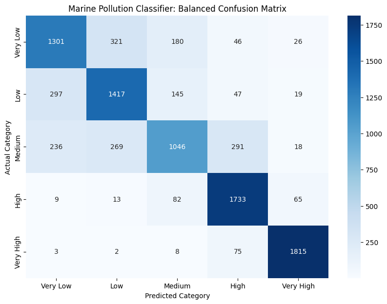
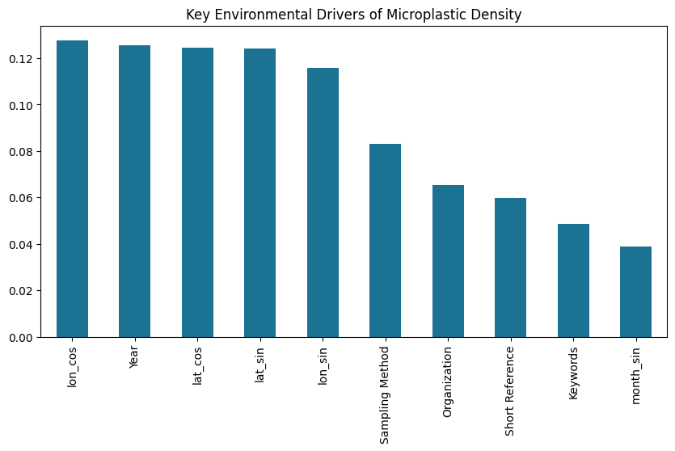

# Marine-Microplastic-Prediction-ML

A high-performance machine learning pipeline for the **Spatio-Temporal Analysis & Predictive Modeling of Global Marine Microplastics**. This project analyzes 50 years of environmental data (1972–2022) to classify pollution severity across five oceanic basins.

## Key Performance Metrics
* **Overall Accuracy:** 77% (Macro F1-Score: 0.77).
* **High-Severity Detection:** **0.94 F1-Score** for the "Very High" pollution class.
* **Balanced Dataset:** Expanded from 20,425 to **47,320 samples** using SMOTE to mitigate class imbalance.

## Technical Sophistication (The "Level-Up")
To achieve professional-grade results, this project implements:
- **Spherical Coordinate Encoding:** Converted raw Latitude and Longitude into **Sin/Cos components** to account for the Earth's global geometry.
- **Cyclical Temporal Mapping:** Encoded months into circular features to preserve the relationship between December and January.
- **Data Leakage Prevention:** Strictly removed direct mass measurements and metadata to ensure the model predicts severity based purely on spatio-temporal features.
- **Class Balancing (SMOTE):** Addressed significant majority-class bias by synthetically generating minority class samples, significantly boosting recall for high-pollution zones.

## Results & Visualization
The model successfully distinguishes between 5 levels of pollution density:
1. **Very Low** | 2. **Low** | 3. **Medium** | 4. **High** | 5. **Very High**

### Confusion Matrix

*Shows the high precision in identifying severe pollution clusters.*

### Feature Importance

*Identifies the primary environmental and temporal drivers of microplastic accumulation.*

## Repository Structure
- `Marine_Microplastic_Pollution_Classification_and_Forecasting.ipynb`: End-to-end data science pipeline (Cleaning, EDA, SMOTE, Training).
- `Marine_Microplastics.csv`: Longitudinal dataset (1972–2022).
- `confusion_matrix.png` & `feature_importance.png`: Visual proofs of model performance.

